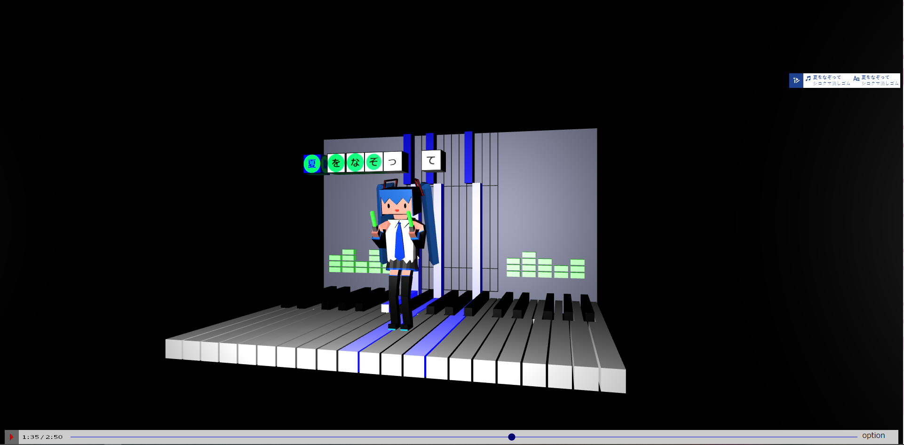

# Miku's Live
[マジカルミライ2021プログラミングコンテスト](https://magicalmirai.com/2021/procon/)に応募するアプリです。



- [TextAlive App API](https://developer.textalive.jp/app/)により楽曲を読み込み、再生しています。
- アプリの表示は主に[Three.js](https://threejs.org/)で行っています。
- 初音ミクの3Dモデルは[Blender](https://www.blender.org/)により作成しました。

## アピールポイント

初音ミクの3DモデルをBlenderで作成し、Three.jsを使って動かしてみました。

制作のコンセプトは、「曲の要素を楽しんで見てもらうこと」です。

そこで、歌詞、ビート、コード、および音量をもとにオブジェクトを作り、動かしています。

ライブの発想は、「プロジェクトセカイ」のバーチャルライブに影響を受けています。

初音ミクの動きは曲ごとに設定し、曲の流れをリズムに乗って感じられるようにしました。

<br>

応募締切までに時間が足りなくなり、ソースコードに実装途中のものが残ってしまったのが少し残念です。

来年があるなら、デザインセンス磨いてまた応募します。


## 違う楽曲で試すには

下記2つの方法でそれぞれ選曲できることを確認済みです。

- アプリ画面右下の「option」をクリック/タップし、出てくる詳細画面から選曲。
- [TextAlive App Debugger](https://developer.textalive.jp/app/run/)など、ホストから選曲。
    (URLのクエリパラメタで`ta_song_url={楽曲のURL}` を指定することで選曲可能)

## ビルド

以下のコマンドで `docs` 以下にビルド済みファイルが生成されます。
```sh
npm install
npm run build
```
また、このリポジトリの `docs` 以下にはビルド済みファイルを格納しています。

## 開発

[Node.js](https://nodejs.org/) をインストールしている環境で、以下のコマンドを順番に別コンソールで実行すると、開発用サーバが起動します。

```sh
npm install
npm run build-dev
```
```sh
cp model/miku.glb dev/
```

※parcel serveで出力先ディレクトリの内容がリセットされ、対処不明だったため、あとからcpでmiku.glbを格納しています。

---